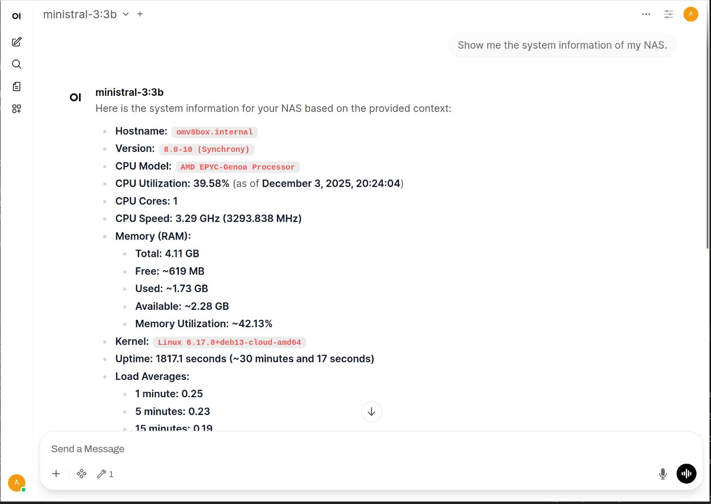
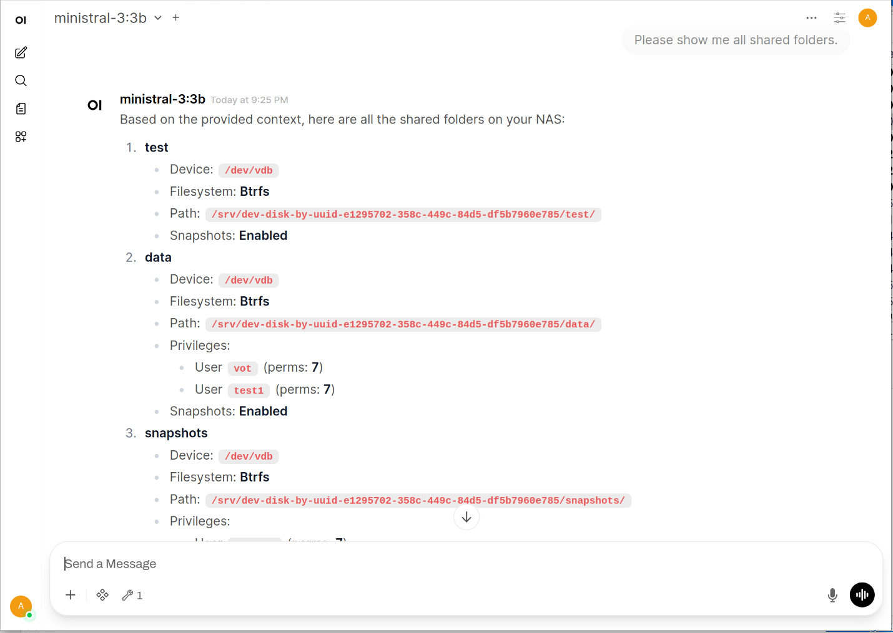

This is the prototype of an MCP server for openmediavault. It was created
during SUSE HackWeek 25.





It is intended to be the basis for a plugin for openmediavault to give users
the ability to administer their system from any chat client, such as Claude Desktop.

The plan is that only the MCP server runs on the openmediavault system and can be
docked to any tool that supports MCP. The connection is then established via URL:

```
http(s)://<FQDN>:8511/mcp
```

# ToDo

- Convert to an openmediavault plugin
- Authentication
- More tools for system administration
- Better error handling
- Tests
- Documentation
- etc.

# The self-hosted LLM stack

This software stack consists of ollama + open-webui + mcpo + openmediavault MCP server.
With the appropriate model, you will have a chat experience similar to ChatGPT.

You will reach the following services after starting the stack:

```
ollama: http://127.0.0.1:11434
open-webui: http://127.0.0.1:3000
mcpo: http://127.0.0.1:8000
openmediavault MCP server: http://127.0.0.1:8511
```

# Start the stack

```bash
make docker
```

# Install model

Download and install a model, e.g. `ministral-3:3b` in the admin settings
page of the `open-webui` at http://127.0.0.1:3000/admin/settings/models.

You can find a list of models at https://ollama.com/search.

# Add MCP server to open-webui as external tool.

Go to http://127.0.0.1:3000/admin/settings/tools and add a new tool.
Use the following settings:

```
Type: OpenAPI
URL: http://mcpo:8000
OpenAPI Spec: openapi.json
Auth: None
ID: omv-mcp
Name: omv-mcp
Description: openmediavault MCP server
Visibility: Public
```
